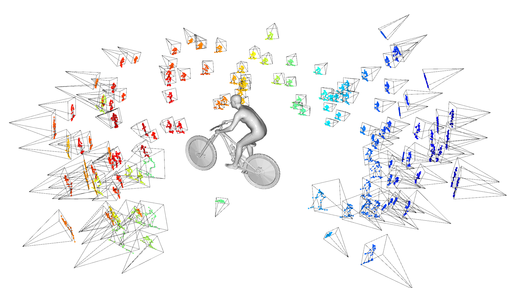

# WildHOI: Monocular Human-Object Reconstruction in the Wild

Implementation for the paper: `Monocular Human-Object Reconstruction in the Wild`.

[](-) [](https://huochf.github.io/WildHOI/) [](-)



## Set up Environments

1. create env. for pytorch and pytorch3d.

```
conda create -n wildhoi python=3.9
conda activate wildhoi
conda install pytorch==1.13.0 torchvision==0.14.0 torchaudio==0.13.0 pytorch-cuda=11.7 -c pytorch -c nvidia
conda install -c fvcore -c iopath -c conda-forge fvcore iopath
conda install -c bottler nvidiacub
conda install pytorch3d -c pytorch3d
```

2. install necessary packages.

```
pip install scipy opencv-python trimesh smplx scikit-image scikit-learn
```

3. compile neural renderer.

```
cd CODE_DIR
mkdir externals
cd ./externals
git clone https://github.com/JiangWenPL/multiperson.git
```

add the following lines

```
#ifndef AT_CHECK 
#define AT_CHECK TORCH_CHECK 
#endif 
```

at the beginning of files `multiperson/neural_renderer/neural_renderer/cuda/*.cpp`. Then compile it,

```
export CUDA_HOME=/public/software/CUDA/cuda-11.3/ (modify this path with your custom setting)
cd multiperson/neural_renderer && python setup.py install
```

## Demo

1. download extra [data](https://drive.google.com/file/d/1OZaghWZnCC2JC3m5SrcgZ4kzYmKUEovj/view?usp=sharing) and put them in the folder `CODE_DIR/data`.

2. Prepare SMPL-X by following the instructions and put them into the folder `CODE_DIR/data`.

3. download [pre-trained model](https://drive.google.com/file/d/1OqEoIgb70XuTTgjciH1ZZJjhP0PKTofl/view?usp=sharing) and put it in the folder `CODE_DIR/outputs/cflow_pseudo_kps2d`. 

4. run

   ```
   python ./demo.py
   ```

   the results are saved to the path `CODE_DIR/outputs/demo`.

## Train

1. download the WildHOI dataset from [here](https://drive.google.com/drive/folders/1yJy_u83KiV1W-6xxAqyLmdGOSt-G_y1C?usp=sharing).
2. generate KPS groups list. (or download them from [here](https://drive.google.com/file/d/107D0Cr6mO77QzyltroTc7xGI7rfROXpE/view?usp=sharing), put them in the folder `CODE_DIR/outputs`).

```
python KNN_grouping_wildhoi.py --root_dir DATASET_ROOT --object barbell --n_steps 100
```

3. Train the normalizing flow. (the pre-trained models are [here](https://drive.google.com/drive/folders/1eC3X6M08wAQvJGiz-kAxL7W4KiK1_Qpx?usp=sharing))

```
python train_kps_flow_wildhoi.py --root_dir DATASET_ROOT --object barbell --batch_size 64 --dropout_probability 0.5
```

4. [Optional] Generate the mean occlusion map. (the pre-generated occlusion maps are [here](https://drive.google.com/file/d/17jd-_OP1VWDX02pfwD5rvbwTLWTaa0En/view?usp=sharing))

```
python get_occlusion_map --root_dir DATASET_ROOT --object barbell
```

## Inference

Optimize the test images:

```
python optimize_with_kps_flow_imagewise.py --root_dir DATASET_ROOT --object barbell
python optimize_with_kps_flow_contact_imagewise.py --root_dir DATASET_ROOT --object barbell
python optimize_with_phosa.py --root_dir DATASET_ROOT --object barbell
```

Results can be visualized via:

```
python visualize_recon_results.py --root_dir DATASET_ROOT --object barbell --exp optim_with_kps_flow
```

## Evaluation

Quantitative evaluation:

```
python evaluate_recon_results.py --exp optim_with_kps_flow --object barbell
```

Results:

<table>
    <caption><b>Comparison on WildHOI-test Dataset</b></caption>
    <thead>
        <tr>
    	    <th rowspan="2", align="center">Method</th>
            <th colspan="2", align="center">Chamfer Distance</th>
            <th colspan="2", align="center">Object Pose Error</th>
        </tr>
        <tr>
        	<th align="center">SMPL(cm) &darr;</th>
        	<th align="center">Object(cm) &darr;</th>
        	<th align="center">Rot.(°) &darr;</th>
        	<th align="center">Transl.(cm) &darr;</th>
        </tr>
    </thead>
    <tbody>
    	<tr>
        	<td align="center">Isolation</td>
        	<td align="center"><b>3.52</b></td>
        	<td align="center">1259.47</td>
        	<td align="center"><b>7.10</b></td>
        	<td align="center">658.10</td>
        </tr>
        <tr>
        	<td align="center">PHOSA</td>
        	<td align="center">4.77</td>
        	<td align="center">51.22</td>
        	<td align="center">11.94</td>
        	<td align="center">33.88</td>
        </tr>
        <tr>
        	<td align="center">KPS Flow (w/o contact)</td>
        	<td align="center">4.44</td>
        	<td align="center">19.54</td>
        	<td align="center">10.05</td>
        	<td align="center">14.35</td>
        </tr>
        <tr>
        	<td align="center">KPS Flow (with contact)</td>
        	<td align="center">4.49</td>
        	<td align="center"><b>17.76</b></td>
        	<td align="center">9.76</td>
        	<td align="center"><b>13.28</b></td>
        </tr>
    </tbody>
</table>

<table>
    <caption><b>Objectwise Comparison on WildHOI-test Dataset</b></caption>
    <thead>
    	<tr>
        	<th align="center">Metrics</th>
            <th align="center">Method</th>
            <th align="center">Barbell</th>
            <th align="center">Baseball</th>
            <th align="center">Basketball</th>
            <th align="center">Bicycle</th>
            <th align="center">Cello</th>
            <th align="center">Skateboard</th>
            <th align="center">Tennis</th>
            <th align="center">Violin</th>
            <th align="center">Average</th>
        </tr>
    </thead>
    <tbody>
    	<tr>
        	<td rowspan="2", align="center">SMPL(cm)&darr;</td>
            <td align="center">PHOSA</td>
            <td align="center"><b>4.50</b></td>
            <td align="center"><b>3.36</b></td>
            <td align="center"><b>3.62</b></td>
            <td align="center">7.24</td>
            <td align="center">7.58</td>
            <td align="center">5.35</td>
            <td align="center"><b>3.91</b></td>
            <td align="center">4.58</td>
            <td align="center">4.77</td>
        </tr>
        <tr>
            <td align="center">Ours</td>
            <td align="center">5.08</td>
            <td align="center">4.09</td>
            <td align="center">4.26</td>
            <td align="center"><b>4.75</b></td>
            <td align="center"><b>6.18</b></td>
            <td align="center"><b>4.19</b></td>
            <td align="center">4.47</td>
            <td align="center"><b>4.12</b></td>
            <td align="center"><b>4.49</b></td>
        </tr>
    	<tr>
        	<td rowspan="2", align="center">Object(cm)&darr;</td>
            <td align="center">PHOSA</td>
            <td align="center">44.62</td>
            <td align="center">36.63</td>
            <td align="center">74.19</td>
            <td align="center">103.30</td>
            <td align="center">35.70</td>
            <td align="center">52.25</td>
            <td align="center">38.82</td>
            <td align="center">57.46</td>
            <td align="center">51.22</td>
        </tr>
        <tr>
            <td align="center">Ours</td>
            <td align="center"><b>8.17</b></td>
            <td align="center"><b>30.31</b></td>
            <td align="center"><b>22.98</b></td>
            <td align="center"><b>12.96</b></td>
            <td align="center"><b>8.08</b></td>
            <td align="center"><b>12.45</b></td>
            <td align="center"><b>21.16</b></td>
            <td align="center"><b>6.62</b></td>
            <td align="center"><b>17.76</b></td>
        </tr>
    	<tr>
        	<td rowspan="2", align="center">Rot.(°) &darr;</td>
            <td align="center">PHOSA</td>
            <td align="center"><b>2.56</b></td>
            <td align="center">26.49</td>
            <td align="center">-</td>
            <td align="center">3.59</td>
            <td align="center"><b>4.95</b></td>
            <td align="center"><b>3.99</b></td>
            <td align="center">20.37</td>
            <td align="center">3.25</td>
            <td align="center">11.94</td>
        </tr>
        <tr>
            <td align="center">Ours</td>
            <td align="center">3.47</td>
            <td align="center"><b>24.30</b></td>
            <td align="center">-</td>
            <td align="center"><b>3.17</b></td>
            <td align="center">5.28</td>
            <td align="center">4.18</td>
            <td align="center"><b>10.97</b></td>
            <td align="center"><b>3.01</b></td>
            <td align="center"><b>9.76</b></td>
        </tr>
    	<tr>
        	<td rowspan="2", align="center">Transl.(cm) &darr;</td>
            <td align="center">PHOSA</td>
            <td align="center">30.53</td>
            <td align="center">22.18</td>
            <td align="center">44.29</td>
            <td align="center">69.83</td>
            <td align="center">26.40</td>
            <td align="center">35.70</td>
            <td align="center">26.04</td>
            <td align="center">37.84</td>
            <td align="center">33.88</td>
        </tr>
        <tr>
            <td align="center">Ours</td>
            <td align="center"><b>8.68</b></td>
            <td align="center"><b>18.20</b></td>
            <td align="center"><b>16.95</b></td>
            <td align="center"><b>11.18</b></td>
            <td align="center"><b>6.41</b></td>
            <td align="center"><b>12.64</b></td>
            <td align="center"><b>14.97</b></td>
            <td align="center"><b>7.11</b></td>
            <td align="center"><b>13.28</b></td>
        </tr>
    </tbody>
</table>
Qualitative evaluation:


```
python human_evaluation.py --root_dir DATASET_ROOT/OBJECT_NAME
```

