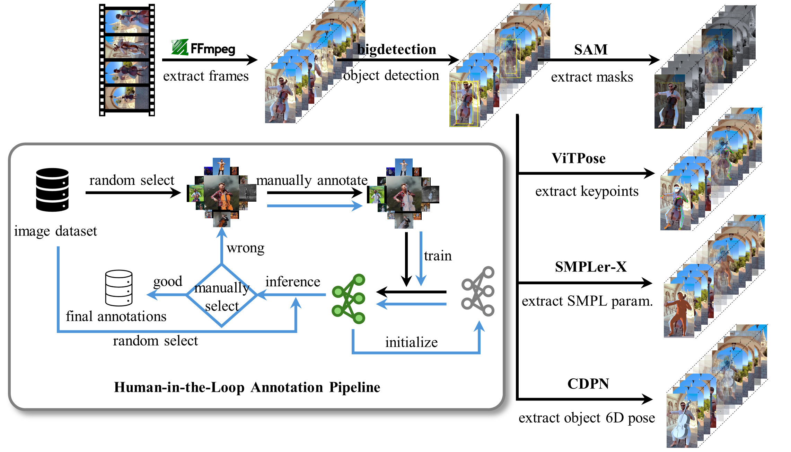

# Data Preprocess Pipeline

## Overview



## 00 Download Videos

* Use the [YouTube downloader]([Tyrrrz/YoutubeDownloader: Downloads videos and playlists from YouTube (github.com)](https://github.com/Tyrrrz/YoutubeDownloader)) to download videos from the YouTube website with selected URLs. 

* Organize these videos into the path `DATASET_ROOT/OBJECT_NAME/videos`.

## 01 Extract Frames

* Rename the videos.

  ```
  cd CODE_DIR/dataset_pipeline/01_extract_frames
  python rename_videos.py --root_dir DATASET_ROOT/OBJECT_NAME/videos
  ```

* Extract frames using [FFmpeg](https://ffmpeg.org/).

  ```
  python extract_frames.py --root_dir DATASET_ROOT/OBJECT_NAME/videos --begin_idx 0 --end_idx 1
  ```

## 02 Object Detection

* Set up environments.

  ```
  cd CODE_DIR/dataset_pipeline/02_object_detection
  git clone https://github.com/amazon-science/bigdetection.git
  ```

  then set up the environments following the [bigdetection instructions](https://github.com/amazon-science/bigdetection).

* Download the pretrained models from [bigdetection]([amazon-science/bigdetection: BigDetection: A Large-scale Benchmark for Improved Object Detector Pre-training (github.com)](https://github.com/amazon-science/bigdetection)) into the path `CODE_DIR/dataset_pipeline/02_object_detection/bigdetection/checkpoints/`. In our experiments, we use [CBNetV2(COCO)](https://big-detection.s3.us-west-2.amazonaws.com/bigdet_cpts/mmdetection_cpts/htc_cbv2_swin_base_giou_4conv1f_bigdet_coco-ft_20e.pth) to detect baseball, bicycle, basketball, skateboard, and tennis, while use [CBNetV2(BigDetection)](https://big-detection.s3.us-west-2.amazonaws.com/bigdet_cpts/mmdetection_cpts/htc_cbv2_swin_base_giou_4conv1f_bigdet.pth) to detect cello and violin.

* To speed up the data preprocessing, we first detect the object at 1 fps.

  ```
  python bigdetection_inference.py --root_dir DATASET_ROOT/OBJECT_NAME --begin_idx 0 --end_idx 1 --interval 30
  ```

* Then filter out the frames where no object is detected or the IoU score between the bounding box of the person and the bounding box of the object exceeds a threshold.

  ```
  python filter_detection.py --root_dir DATASET_ROOT/OBJECT_NAME --begin_idx 0 --end_idx 1 --interval 30 --object_name OBJECT_NAME
  ```

* Finally, detect the object at 30 fps.

  ```
  python bigdetection_inference.py --root_dir DATASET_ROOT/OBJECT_NAME --begin_idx 0 --end_idx 1 --interval 30
  ```

## 03 Track HOI

* Track human with [SORT](https://github.com/abewley/sort).

  ```
  cd CODE_DIR/dataset_pipeline/03_track_hoi
  python track_hoi_with_sort.py --root_dir DATASET_ROOT/OBJECT_NAME --begin_idx 0 --end_idx 1
  ```

* Visualize the results of tracking.

  ```
  python visualize_hoi_tracking_bbox.py --root_dir DATASET_ROOT/OBJECT_NAME --begin_idx 0 --end_idx 1 --save_dir ../../temp
  ```

* Manually review the sequences and select the good ones (one person and one object are under interaction).

* Update the tracking results of SORT.

  ```
  python select_sequences.py
  python filter_sequences.py --root_dir DATASET_ROOT/OBJECT_NAME
  ```

* Clean the 'blank' frames.

  ```
  python clean_frames.py --root_dir DATASET_ROOT/OBJECT_NAME --begin_idx 0 --end_idx 1
  ```

* Extract masks using [SAM](https://github.com/facebookresearch/segment-anything)  and [XMem](https://github.com/hkchengrex/XMem) to refine the tracking results.

  ```
  cd CODE_DIR/dataset_pipeline/03_track_hoi/tracker
  git clone https://github.com/hkchengrex/XMem.git
  ```

  Set up the environments following the instructions in [SAM](https://github.com/facebookresearch/segment-anything)  and [XMem](https://github.com/hkchengrex/XMem).  Download the pretrained models ([sam_huge](https://dl.fbaipublicfiles.com/segment_anything/sam_vit_h_4b8939.pth) and [XMen-s012](https://drive.google.com/drive/folders/1QYsog7zNzcxGXTGBzEhMUg8QVJwZB6D1?usp=sharing)) to the folder `CPDE_DIR/dataset_pipeline/03_track_hoi/weights`.Then run

  ```
  python extract_mask_and_track.py --root_dir DATASET_ROOT/OBJECT_NAME --begin_idx 0 --end_idx 1
  ```

  The mask can be visualized by running

  ```
  python visualize_hoi_tracking.py --root_dir DATASET_ROOT/OBJECT_NAME --video_idx 0
  ```

## 04 Extract ViTPose

* Set up environments following the [ViTPose instructions](https://github.com/ViTAE-Transformer/ViTPose).

  ```
  cd CODE_DIR/dataset_pipeline/04_extract_pose
  git clone https://github.com/ViTAE-Transformer/ViTPose.git
  ```

* Download the [ViTPose-H](https://1drv.ms/u/s!AimBgYV7JjTlgccoXv8rCUgVe7oD9Q?e=ZBw6gR) to path `CODE_DIR/dataset_pipeline/04_extract_pose/pretrained_models`.

* Extract the wholebody keypoints of person.

  ```
  python extract_body_pose.py --root_dir DATASET_ROOT/OBJECT_NAME --begin_idx 0 --end_idx 1
  ```

  To visualize the wholebody kps, you can run

  ```
  python visualize_wholebody.py --root_dir DATASET_ROOT/OBJECT_NAME --video_idx 0 --sequence_idx 0
  ```

* [Optional] Set up the environments of [mmpose](https://github.com/open-mmlab/mmpose) and download hand pose (hrnetv2_w18_wholebody_hand) model and face kps model (rtmpose-wholebody-face) from [model zoo](https://mmpose.readthedocs.io/en/latest/model_zoo/hand_2d_keypoint.html). 

* [Optional] Refine hand kps and face kps.

  ```
  python extract_face_hand_pose.py --root_dir DATASET_ROOT/OBJECT_NAME --begin_idx 0 --end_idx 1
  ```

## 05 Extract SMPL-X Param.

* Set up environments following the [SMPLer instructions](https://github.com/caizhongang/SMPLer-X).

* Run

  ```
  cd CODE_DIR/dataset_pipeline/05_smpler_x
  python extract_smpl_params.py --root_dir DATASET_ROOT/OBJECT_NAME --begin_idx 0 --end_idx 1
  ```

  The smpl param. can be visualized by running

  ```
  python visualize_smplx.py --root_dir DATASET_ROOT/OBJECT_NAME --video_idx 0 --sequence_idx 0
  ```

## 06 Optimize SMPL-X Param.

```
cd CODE_DIR/dataset_pipeline/06_optimize_smplx
python optimize_smpl_seq.py --root_dir DATASET_ROOT/OBJECT_NAME --begin_idx 0 --end_idx 1
```

The smpl param. can be visualized by running

```
python visualize_smplx.py --root_dir DATASET_ROOT/OBJECT_NAME --video_idx 0 --sequence_idx 0
```

## 07 Annotate Object Pose

1. Crop the object into patches (crop_images.py).

2. Annotate the keypoints using the [annotation tool](https://github.com/pprp/landmark_annotation).

3. Solve the 6D pose of the object from keypoint annotations. (fit_object_with_keypoints.py).

4. Visualize the solved 6D pose. (visualize_object_pose.py & examine_results.py).

5. Manually filter out the wrong 6D poses (filter_valid_pose.py).

6. Generate the corresponding maps for each object (render_coor_map.py).

## 08 Extract 6D Pose of Object

7. Train the 6D pose estimator (train.py).
8. Show the quality of the 6D pose estimator and manually select the bad 6D pose (inference.py).
9. Repeat 1-8 until the quality of the 6D pose estimator is satisfying.
10. Extract the 6D pose of the object (extract_object_pose).

## 09 Prepare HOI keypoints

```
cd CODE_DIR/dataset_pipeline/09_prepare_hoi_kps
python prepare_hoi_kps.py --root_dir DATASET_ROOT/OBJECT_NAME
```

## 10 Prepare HOI Annotations

* Prepare images for contact annotations. (prepare_annotation_contact_image.py)

* Manually annotate contact for each image. 

* Optimize HOI with contact labels. (optimize_hoi_with_contact_labels_v2.py)

* Manually filter out inconsistent results.

* Label the relative pose using the object pose annotation tools. (annotator/)

  ```
  python -m annotator.main --image_dir .\data\skateboard\images\ --params_dir .\data\skateboard\params\ --output_dir .\data\skateboard\params --object skateboard
  ```

* Visualize HOI annotations. (visualize_recon_results.py)

